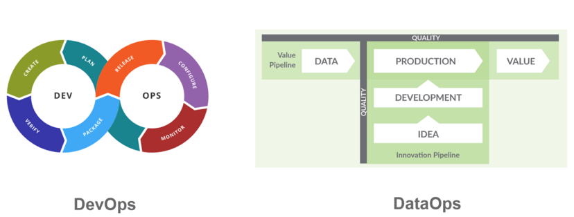
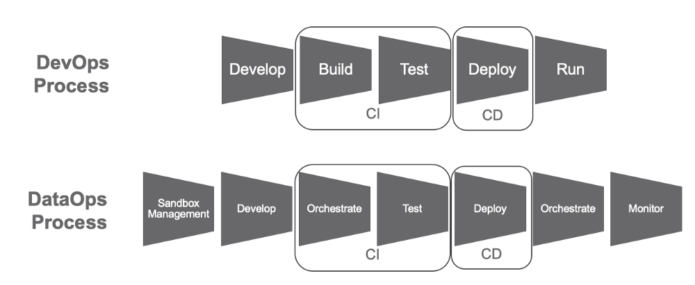
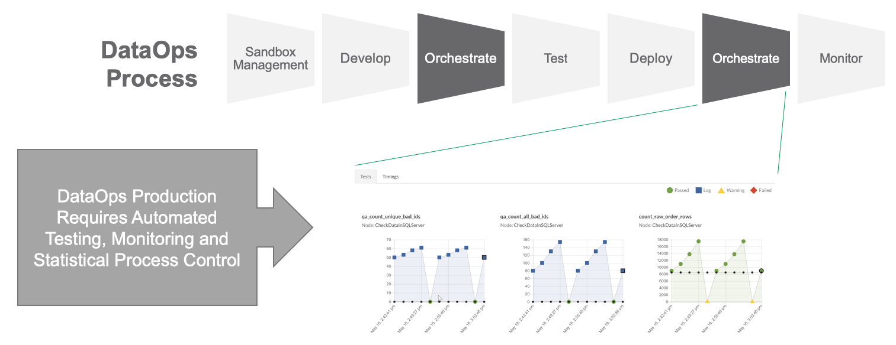
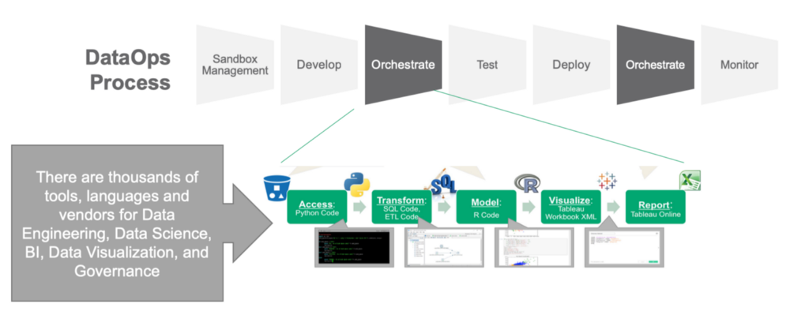
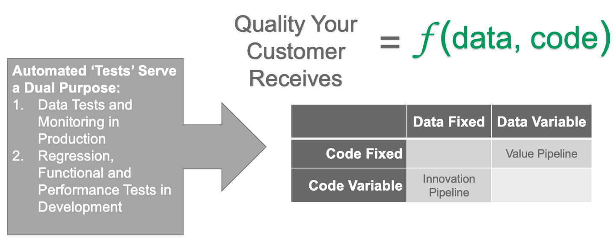
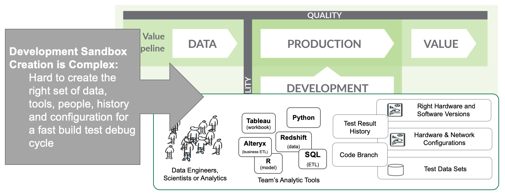
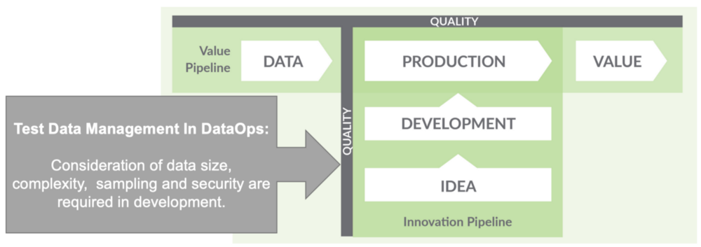

## Principles

1. **CONTINUALLY SATISFY YOUR CUSTOMER**
  > satisfy the customer through the early and continuous delivery of valuable analytic insights from minutes to weeks
2. **VALUE WORKING ANALYTICS**
  > primary measure of data analytics performance is the degree to which insightful analytics are delivered, incorporating accurate data, atop robust frameworks and systems.
3. **IT'S A TEAM SPORT**
  - analytic teams involve variety of roles, skills, tools and titles (DS, DE, Analysts)
  - self-organizing and transparent teams
4. **DAILY INTERACTIONS**
  - across teams throughout the project
  - visibility across teams is a must
5. **REDUCE HEROISM**
  -
6. **REFLECT**
  - teams should fine-tune their OP performance by self-reflecting at regular intervals
7. **ANALYTICS IS CODE**
  -
8. **ORCHESTRATE**
  - E2E orchestration of data, tools, code, environments is a key driver of success
9. **MAKE IT REPRODUCIBLE**
  - reproducible results are required and therefore version everything: data, HW and software configs, code to each tool in the toolchain
10. **DISPOSABLE ENVIRONMENTS**
  - creation of isolated, safe, and disposable tech environments that reflect production environment for each team member
11. **SIMPLICITY**
  - continuous attention to technical excellence
12. **MANUFACTURING**
  - pipelines are analogous to lean manufacturing lines
  - *focus on process-thinking aimed at achieving continuous efficiencies in the manufacture of analytic insight*
13. **QUALITY IS PARAMOUNT**
  - automated detection of anomalies and security issues in code, configs, and data should be provide continuous feedback
14. **MONITOR QUALITY AND PERFORMANCE**
  > goal is to have performance, security, and quality measures that are monitored continuously to detect unexpected variation and generate operational statistics
15. **REUSE**
  - avoid the repetition of previous work
16. **IMPROVE CYCLE TIMES**
  - strive to minimize the time and effort to turn a customer need into an analytic idea
  - create it in DEV, release it as a repeatable PROD process
  - refactor and reuse the product

## What is DataOps

  - *Delivering Analytics at Amazon Speed - Free same-day delivery*

> DataOps is a combination of tools and methods, which streamline the development of new analytics while ensuring impeccable data quality. DataOps helps shorten the cycle time for producing analytic value and innovation, while avoiding the trap of “hope, heroism and caution.” - DataKitchen Book

- Agile methologies
- DevOps = CI/CD + Agile + IaC + design + test + QA + Cloud
- Lean Manufacturing = Tests + QA (along the pipeline)

##### Agile + DevOps + Lean Manufacturing = DataOps

- communication
- collaboration
- integration
- automation
- measurement
- cooperation between data scientists, analysts, DE, IT, QA/Governance

#### How to Implement DataOps

##### Data + Tests

*How do you know that you did not break anything?*

- tests are added incrementally with the addition of each feature
- tests gradually improve and quality is built in
- tests for each stage in the pipeline
- automated tests continuously monitor the data pipeline

##### Version Control System
- artifacts associated with the data pipeline have to be maintained in a VC such as Git
- Data can be version controlled as well

##### Multiple Environments
- everyone has it's own isolated environment which reflects (almost) production

##### Reuse
- break things into smaller components
- expect the output of every pipeline to become the input to another

##### Parametrize The Pipeline

### DataOps != DevOps for Data

- DevOps: optimize builds and delivery (CI/CD)
- DataOps: reduce E2E cycle time of data analytics, from ideas to charts, dashboard models

#### Human Factor

- DevOps: serve the needs of software developers
- DataOps: serve the needs of DS, DE, and Analysts who want build and deploy models or visualizations (less tech savvy as engineers)

#### Process

- TBH I think it's the same.

#### Development and Deployment

##### The Duality of Orchestration in DataOps

- This is really vague for me; it's a redundancy

#### Testing

- data
- code

##### Sandbox Management

- isolated environments

#### Test Data Management

- the  automation  of development environments with the needed data
- security, governance or license restrictions

#### Resources

* [DataKitchen](https://medium.com/data-ops/dataops-is-not-just-devops-for-data-6e03083157b7)
