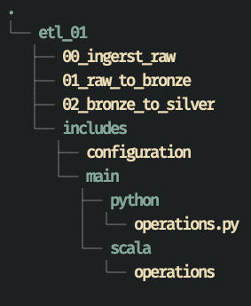
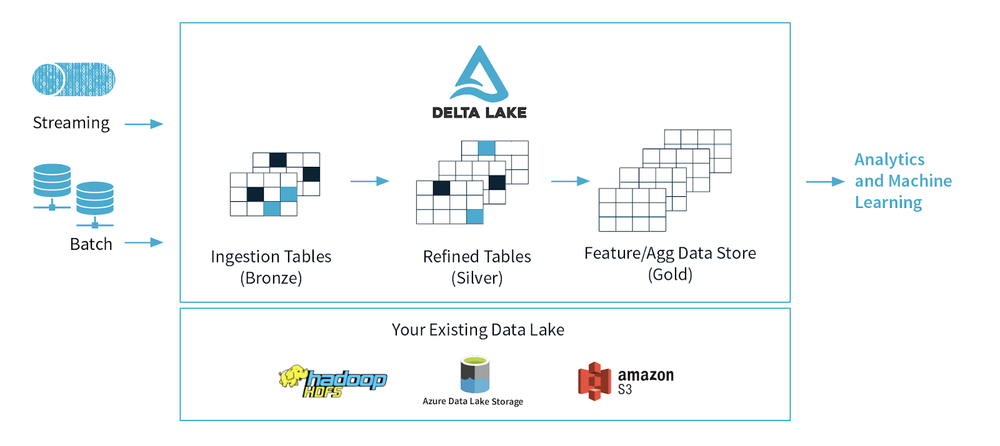

# Batch Delta Tables

## 📂 Project Structure

> "Just as Code Style, API Design, and Automation are essential for a healthy development cycle, Repository structure is a crucial part of your [project’s architecture](https://docs.python-guide.org/writing/structure/)."



* _etl\_01_: pipeline root name
* at the the root of _etl\_01_
  * pipeline notebooks
  * `main.py` scheduled notebook that runs the entire pipeline
* `includes`
  * all the operation functions and other modules
* `configuration`
  * **Notebook with all the configuration files:**
  * Paths to `bronzeTable`, `silverTable`, `goldenTable`
  * Global variables
  * Database configs
  * Connection strings

```python
classicPipelinePath = f"dbfs:/shared/{username}/dataengineering/etl_01/"

rawPath = classicPipelinePath + "raw/"
bronzePath = classicPipelinePath + "bronze/"
silverPath = classicPipelinePath + "silver/"
goldPath = classicPipelinePath + "gold/"

spark.sql(f"CREATE DATABASE IF NOT EXISTS db_{username}")
spark.sql(f"USE db_{username}")
```

## 🏗️ Pipeline



### 🛠️ ETL - Raw to Bronze

```javascript
{"time":"2020-01-01 01:00:00","name":"Armando Clemente","device_id":"2","steps":0,"day":1,"month":1,"hour":1}
{"time":"2020-01-01 01:00:00","name":"Meallan O'Conarain","device_id":"3","steps":0,"day":1,"month":1,"hour":1}
```

* ingest always raw \(string\) data
* as part of ingestion process record some _metadata_
  * data source
  * ingestion time
  * ingestion date used for partitioning
  * status, \(some kind of flag\)
* `write` Batch to _Bronze Table_:

  ```text
  df.write
    .format("delta")
    .mode("append")
    .partitionBy("p_ingestdate")
    .save(bronzePath)
  ```

* `save` does not register the table in _metastore_. So we need to do:

```python
spark.sql("""
DROP TABLE IF EXISTS bronze_table
""")

spark.sql(f"""
CREATE TABLE bronze_table
USING DELTA
LOCATION '{bronzePath}'
""")
```

* Save the DF with `saveAsTabble` which registers the table in _metastore_ 
* Purge the raw files that have been loaded

### 🛠️ ETL - Bronze to Silver

* Transform/augment data
  * flatten JSON
  * Apply some DQ Framework
    * Quarantine the bad records for later processing
* Save the _Silver Table_
* Update _Bronze Table_ to Reflect the Loads \(flag in bronze table which indicates if the record was inserted or not\)
  * `dataframe` is the Silver Data Frame being processed
  * `bronzeTablePath` table with all the bronze data
  * `DeltaTable` API creates a reference to the _Bronze Table_ 
  * `match` is based on some unique identifier


_update\_bronze\_table\_status_ takes`SparkSession`as argument: this is a good practice, since we can pass our local `SparkSession` as parameter and run tests. On Databricks the cluster is already configured and we can just access with`spark.` 


```python
def update_bronze_table_status(
    spark: SparkSession, bronzeTablePath: str, dataframe: DataFrame, status: str
) -> bool:

    bronzeTable = DeltaTable.forPath(spark, bronzePath)
    dataframeAugmented = dataframe.withColumn("status", lit(status))

    update_match = "bronze.value = dataframe.value"
    update = {"status": "dataframe.status"}

    (
        bronzeTable.alias("bronze")
        .merge(dataframeAugmented.alias("dataframe"), update_match)
        .whenMatchedUpdate(set=update)
        .execute()
    )

    return True
```

* Update quarantined records \(quarantined records should have their _Bronze table_ status updated to `quarantined` or some other flag\). 

### 🛠️ ETL - Silver Table Updates

**Notebook:** `03_silver_updates`

* Batch loading has no mechanism for `checkpointing` - we only want to load _new records_ from the _Bronze Table_
* We need to explicitly harden ourselves the pipeline 
* Handle quarantined records
  * Load quarantined records from the _Bronze Table_
  * Transform the quarantined records
  * Batch write the repaired \(formerly quarantined\) records to the _Silver Table_
  * Updated the _Bronze Table_ with the repaired \(formerly quarantined\) records

## 🌟 Summary

### 🛠️ **raw\_to\_bronze**

* Data Ingestion: data arrives in some format JSON or CSV
* Batch read the raw data
* Add ingestion metadata
* Don't do any transformation on the data at this stage!
* Batch write data and register it in _metastore_
* Purge the ingested raw data \(delete or move to different bucket\)

```python
ingest_classic_data(hours=1)
rawDF = read_batch_raw(rawPath)
transformedRawDF = transform_raw(rawDF)
rawToBronzeWriter = batch_writer(
    dataframe=transformedRawDF, partition_column="p_ingestdate"
)
rawToBronzeWriter.save(bronzePath)
dbutils.fs.rm(rawPath, recurse=True)
```

### 🛠️ **bronze\_to\_silver**

* Batch read \(new records\) records
* Transform / augment data
* Apply DQ \(valid & rejected records\)
* Batch write `silverCleandDF` records
* Update _Bronze Table_ \(flag\)
  * current valid records
  * current rejected records

```python
bronzeToSilverWriter = batch_writer(
    dataframe=silverCleanDF, partition_column="p_eventdate", exclude_columns=["value"]
)
bronzeToSilverWriter.save(silverPath)
update_bronze_table_status(spark, bronzePath, silverCleanDF, "loaded")
update_bronze_table_status(spark, bronzePath, silverQuarantineDF, "quarantined")
```

### 🛠️ **update\_silver\_table**

* Read and repair rejected records from _Bronze Table_
* Write repaired records to _Silver Table_
* Update _Bronze Table_ status

```text
bronzeToSilverWriter = batch_writer(
    dataframe=silverCleanedDF, partition_column="p_eventdate", exclude_columns=["value"]
)
bronzeToSilverWriter.save(silverPath)
update_bronze_table_status(spark, bronzePath, silverCleanedDF, "loaded")
```

