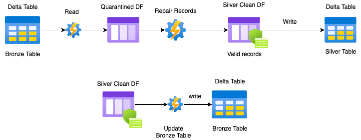

# Classic Batch Processing

## 📂 Project Structure

> "Just as Code Style, API Design, and Automation are essential for a healthy development cycle, Repository structure is a crucial part of your [project’s architecture](https://docs.python-guide.org/writing/structure/)."

```test
.
└── etl_01
   ├── 00_ingest_raw.py
   ├── 01_raw_to_bronze.py
   ├── 02_bronze_to_silver.py
   ├── 03_silver_update.py
   ├── 04_main.py
   └── includes
      ├── configuration.py
      ├── main
      │  ├── python
      │  │  ├── operations.py
      │  │  └── utilities.py
      │  └── scala
      │     └── operations
      └── tests
```

- `etl_01`: name of the pipeline
- `includes`: utility functions and other modules
- `configuration`:

```python
classicPipelinePath = f"dbfs:/shared/{username}/dataengineering/etl_01/"

rawPath = classicPipelinePath + "raw/"
bronzePath = classicPipelinePath + "bronze/"
silverPath = classicPipelinePath + "silver/"
goldPath = classicPipelinePath + "gold/"

spark.sql(f"CREATE DATABASE IF NOT EXISTS db_{username}")
spark.sql(f"USE db_{username}")
```

## 🏗️ Pipeline

### 🛠️ ETL - Raw to Bronze


```javascript
{"time":"2020-01-01 01:00:00","name":"Armando Clemente","device_id":"2","steps":0,"day":1,"month":1,"hour":1}
{"time":"2020-01-01 01:00:00","name":"Meallan O'Conarain","device_id":"3","steps":0,"day":1,"month":1,"hour":1}
```

- Data ingestion: data arrives in some format `JSON` or `CSV`
- Batch read the raw data: read raw data `str` when it comes to `JSON`
- Record ingestion _metadata_: `ingestine`, `ingestdate`, `status`, `datasource`
- Batch write data and register it in _metastore_

```python
df.write
.format("delta")
.mode("append")
.partitionBy("p_ingestdate")
.save(bronzePath)
```

- `save` does not register the table in _metastore_. So we need to do:

```python
spark.sql("""
DROP TABLE IF EXISTS bronze_table
""")

spark.sql(f"""
CREATE TABLE bronze_table
USING DELTA
LOCATION '{bronzePath}'
""")
```

- Save the DF with `saveAsTabble` which registers the table in _metastore_
- Purge the raw files that have been ingested to the **Bronze Table**

### 🛠️ ETL - Bronze to Silver


- Batch read **Bronze Table**
- Transform and augment data
- Apply DQ Framework
  - Constraint checking
- Batch write _Silver Clean DF_ to **Silver Table**
- Update **Bronze Table** to reflect the changes:
  - `loaded` records
  - `quarantined` records

### 🛠️ ETL - Silver Table Updates



- Handle quarantined records
  - Load `quarantined` records from the **Bronze Table**
  - Repair the `quarantined` records
  - Batch write the repaired \(formerly quarantined\) records to the **Silver Table**
  - Updated the **Bronze Table** with the repaired \(formerly quarantined\) records

## 🌟 Pseudo-code

```python
rawDF = read_batch_raw(rawPath)
transformedRawDF = transform_raw(rawDF)
rawToBronzeWriter = batch_writer(
    dataframe=transformedRawDF, partition_column="p_ingestdate"
)

rawToBronzeWriter.save(bronzePath)

dbutils.fs.rm(rawPath, recurse=True)

bronzeDF = read_batch_bronze(spark)
transformedBronzeDF = transform_bronze(bronzeDF)

(silverCleanDF, silverQuarantineDF) = generate_clean_and_quarantine_dataframes(
    transformedBronzeDF
)

bronzeToSilverWriter = batch_writer(
    dataframe=silverCleanDF, partition_column="p_eventdate", exclude_columns=["value"]
)
bronzeToSilverWriter.save(silverPath)

update_bronze_table_status(spark, bronzePath, silverCleanDF, "loaded")
update_bronze_table_status(spark, bronzePath, silverQuarantineDF, "quarantined")

silverCleanedDF = repair_quarantined_records(
    spark, bronzeTable="bronze_table"
)

bronzeToSilverWriter = batch_writer(
    dataframe=silverCleanedDF, partition_column="p_eventdate", exclude_columns=["value"]
)
bronzeToSilverWriter.save(silverPath)

update_bronze_table_status(spark, bronzePath, silverCleanedDF, "loaded")
```
