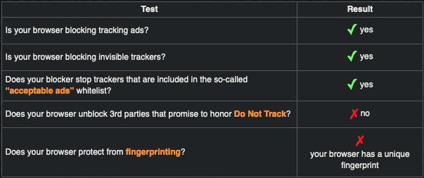
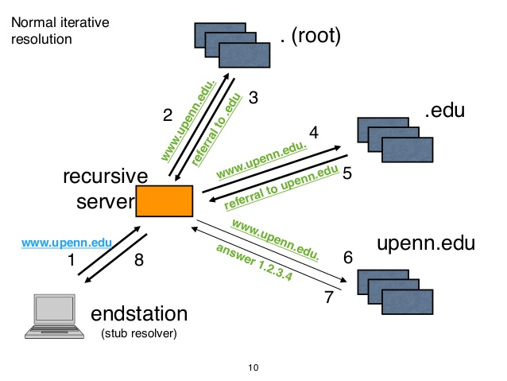

# Privacy & Security


**Problem?** Tracking, surveillance and centralized ecosystems. **Approach?** 


## 🌍 Browsers


Use different browsers and [profiles](https://support.mozilla.org/en-US/kb/dedicated-profiles-firefox-installation#w_what-are-profiles) for different use cases. Below is my personal set up.




**Browser: Firefox**

🔰 Logged in with a Firefox account in order to sync tabs and bookmarks

🔰 2 Factor-Authentication Enabled

🔰 Custom config file to secure the browser even more.



**Browser: Firefox**

🔰 Used to overthrown governments

🔰 Most enhanced settings for privacy and security without relying on any addons with a custom [user.js](https://github.com/arkenfox/user.js/wiki/1.1-Overview) configuration file

**Resource**: [Enhance Your Browser's Privacy & Security with Ghacks/user.js](https://www.youtube.com/watch?v=rkVbsVskqc8&list=PL3cu45aM3C2BwSi8Nj5aBWTrbjbHiXxQo&index=2)



**Browser**: Brave Browser

🔰 Used mostly for convenience when Firefox breaks



**Browser**: Google Chrome

🔰 Used solely for work and accessing Google Cloud Services



### ⚒️ Extensions

* \*\*\*\*[**uBlock**](https://addons.mozilla.org/en-US/firefox/addon/ublock-origin/)**:** wide-spectrum content blocker. Requires set of manual custom configurations. Requires a set of manual custom [configurations](https://www.maketecheasier.com/ultimate-ublock-origin-superusers-guide/) - what domains to block.
* \*\*\*\*[**User-Agent Switcher**](https://gitlab.com/ntninja/user-agent-switcher)**:** spoofs the user agent.
* \*\*\*\*[**Decentraleyes**](https://addons.mozilla.org/en-US/firefox/addon/decentraleyes/)**:** prevents fingerprinting.
* [**Privacy Badger**](https://addons.mozilla.org/en-US/firefox/addon/privacy-badger17/)**:** contains a list of most common trackers which is being updated by default.
* \*\*\*\*[**Facebook Container**](https://addons.mozilla.org/en-US/firefox/addon/facebook-container/): prevents Facebook to tracking you.

### 🧪 Test Your Browser Against Tracking <a id="test-your-browser-against-tracking"></a>



* [Panopticlick](https://panopticlick.eff.org/)
* `Do Not Track` - it's fine ✅, we do not want to **unblock** 3rd parties even if they "promise" not to track us - just block them!
* `fingerprinting` user-agent switcher spoofs our fingerprint, so we're good ✅

### 🔍 Search Engines

* [DuckDuckGo](https://duckduckgo.com/)
* [Startpage.com](https://startpage.com/) 
  * Obviously: _"You can’t beat Google when it comes to online search."_ but there are ways how you can get answers and still get rid of trackers and logs.

### 🕵🏾‍♀️ Password Managers

* [1Password](https://1password.com/)
  * Convenient way to store and use passwords
  * Con's: stores your passwords on the cloud and \(might\) expose them to anybody \(hackers, government agencies, etc.\) 😖
* [KeePassXC Password Manager](https://keepassxc.org/)
  * Offline password manager
  * Most secure and Open-source

### 📧 Emails

* Proton

## 💻 Operating System \(darwin\)


[**Y**](https://sneak.berlin/20201112/your-computer-isnt-yours/)\*\*\*\*[**our Computer Isn't Yours**](https://sneak.berlin/20201112/your-computer-isnt-yours/) **-** your computer serves a remote master, who has decided that they are entitled to spy on you.


### ⚡ Spoof MAC Address

* A MAC address is a unique identifier assigned to your network card
* Each time you connect to a network your MAC address is logged - avoid tracing
* [How to spoof your MAC address and hostname automatically at boot on macOS - Sun Knudsen](https://sunknudsen.com/privacy-guides/how-to-spoof-your-mac-address-and-hostname-automatically-at-boot-on-macos)



```bash
# download mac-address-prefixes.txt
curl -o /usr/local/sbin/mac-address-prefixes.txt https://sunknudsen.com/static/media/privacy-guides/how-to-spoof-your-mac-address-and-hostname-automatically-at-boot-on-macos/mac-address-prefixes.txt

# copy to the terminal
cat << "EOF" > /usr/local/sbin/spoof.sh
#! /bin/sh

set -e

export LC_CTYPE=C

basedir=$(dirname "$0")

# Spoof MAC address of en0 interface
mac_address_prefix=`sed "$(jot -r 1 1 768)q;d" $basedir/mac-address-prefixes.txt | sed -e 's/[^A-F0-9:]//g'`
mac_address_suffix=`openssl rand -hex 3 | sed 's/\(..\)/\1:/g; s/.$//'`
mac_address=`echo "$mac_address_prefix:$mac_address_suffix" | awk '{print toupper($0)}'`
sudo ifconfig en0 ether "$mac_address"
printf "%s\n" "Spoofed MAC address of en0 interface to $mac_address"
EOF

# make spoof.sh executable
chmod +x /usr/local/sbin/spoof.sh

# create a local.spoof.plist launch deamon
cat << "EOF" | sudo tee /Library/LaunchDaemons/local.spoof.plist
<?xml version="1.0" encoding="UTF-8"?>
<!DOCTYPE plist PUBLIC "-//Apple//DTD PLIST 1.0//EN" "http://www.apple.com/DTDs/PropertyList-1.0.dtd">
<plist version="1.0">
  <dict>
    <key>Label</key>
    <string>spoof</string>

    <key>ProgramArguments</key>
    <array>
        <string>/usr/local/sbin/spoof.sh</string>
    </array>

    <key>RunAtLoad</key>
    <true/>
  </dict>
</plist>
EOF
```



### 🚁 VPN

* ISP selling your data
* [NordVPN](https://nordvpn.com/)
* [Apple Apps can bypass](https://appleterm.com/2020/10/20/macos-big-sur-firewalls-and-vpns/) VPN in OSX Big Sur

### 👻 Secure your DNS Queries with Encrypted DNS

* [DNS Server](https://www.lifewire.com/what-is-a-dns-server-2625854) is configured and using address space `127.0.0.1` which means it's using the configs of your router
* By default your router pulls DNS Server from your ISP
  * Root of the problem - ISP does not use `encrypted` DNS Server or `qname minimization`
    * Don't send the entire URL to each domain level to resolve the URL
    * `[www.upenn.edu](http://www.upenn.edu)` → DNS Server → `1.2.3.4`
    * Test whether `qname minimization` is working

```text

dig +short txt qnamemintest.internet.nl
```



### 👨🏿‍🏭 DNS Providers

* [Encrypted DNS Resolvers \| PrivacyTools](https://www.privacytools.io/providers/dns/)
* [NextDNS](https://my.nextdns.io/b71159/setup)
* [Cloudflare ESNI Checker \| Cloudflare](https://www.cloudflare.com/ssl/encrypted-sni/)

### 😈 Little Snitch


